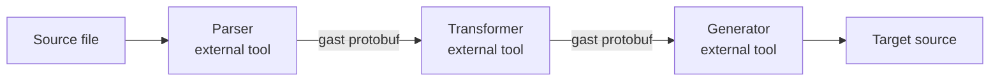
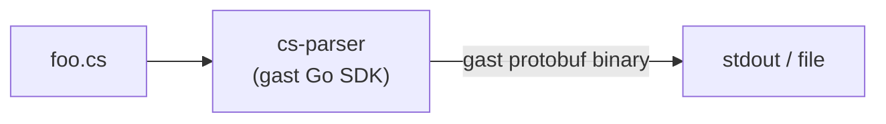
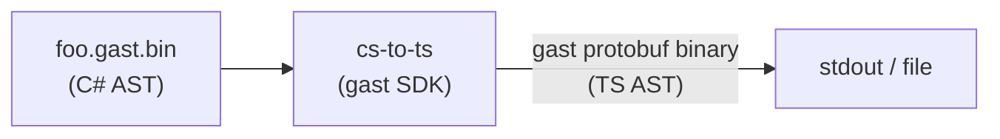
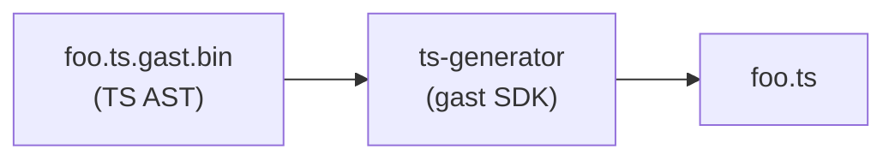
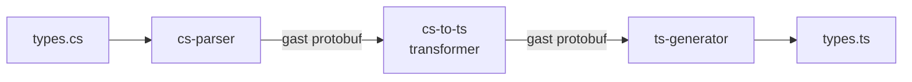
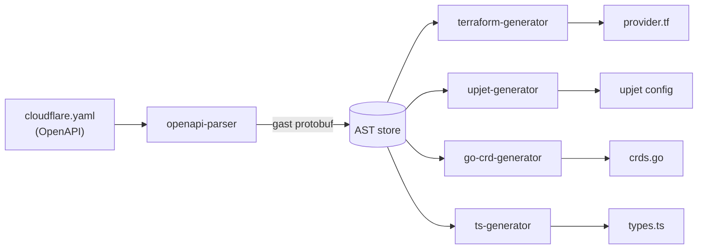

# gast — Use Cases

**Status:** Living document — add use cases as pipelines are built  
**Last updated:** 2026-06-18

---

## Model

`gast` ships a protobuf schema and generated SDKs. It does not parse, transform, or generate source code. All active pipeline work happens in external tools built against the gast SDK.

Three primitive tool roles:

| Role | Input | Output |
|------|-------|--------|
| **Parser** | Source file | gast protobuf binary |
| **Transformer** | gast protobuf (source lang) | gast protobuf (target lang) |
| **Generator** | gast protobuf | Source file |



Stages are composable and optional. A parser alone is valid for inspection or storage. Transformer and generator stages may be omitted or chained multiple times.

---

## In-Scope Use Cases

### UC-1: Writing a parser

**Actor:** Developer adding a new source language to a gast pipeline  
**Goal:** Produce a gast-conformant protobuf binary from source files

The developer imports a gast SDK, parses source with any available parser (language stdlib, TreeSitter, etc.), maps parse tree nodes to gast core + language-extension protobuf messages, and serializes to binary.



```sh
cs-parser foo.cs > foo.gast.bin
```

---

### UC-2: Writing a transformer

**Actor:** Developer mapping one language's AST to another  
**Goal:** Convert a gast-serialized source-language AST to a gast-serialized target-language AST

The developer imports a gast SDK, deserializes a gast binary, walks the source AST, produces target-language gast messages, and serializes back to binary.



```sh
cs-parser foo.cs | cs-to-ts > foo.ts.gast.bin
```

Transformer lives outside the gast repo. gast provides the schema and SDKs; the mapping logic is the consumer's responsibility.

---

### UC-3: Writing a generator

**Actor:** Developer emitting target source from a gast AST  
**Goal:** Produce source code in a target language from a gast protobuf binary

The developer imports a gast SDK, deserializes a gast binary, walks AST nodes, and emits target language syntax.



```sh
cs-to-ts foo.cs.gast.bin | ts-generator > foo.ts
```

---

### UC-4: End-to-end consumer pipeline

**Actor:** Developer with C# types who wants TypeScript equivalents  
**Goal:** Produce TypeScript type definitions from C# source without writing a wire format

The developer finds or writes a `cs-parser`, finds or writes a `cs-to-ts` transformer, finds or writes a `ts-generator`, and chains them. gast provides the schema both tools speak — the developer only needs to write (or find) the transformation logic, not a new interchange format.



```sh
cs-parser types.cs | cs-to-ts | ts-generator > types.ts
```

---

### UC-5: Fan-out pipeline

**Actor:** Developer with a single source AST feeding multiple generators  
**Goal:** Parse once, generate many outputs without re-parsing or coupling generators to each other

Motivating example: an OpenAPI spec parsed to a gast AST, then independently fed to a Terraform provider generator, an Upjet provider generator, a Go CRD generator, and a TypeScript generator for initcontainer types.



Adding a new output requires only a new generator. The parser is unchanged and has no knowledge of downstream consumers.

---

## Out-of-Scope Use Cases

### OOS-1: Using gast to parse source

`gast` ships no parsers. A gast-compatible external parser must exist or be written.

```sh
gast parse foo.cs   # ✗ — gast has no knowledge of C#
cs-parser foo.cs    # ✓ — external tool that speaks gast protobuf
```

---

### OOS-2: Using gast to transform ASTs

AST conversion is out of scope for the gast repo. Transformers are external tools that use the gast SDK.

---

### OOS-3: Editor tooling and real-time parsing

gast targets offline, batch pipeline use cases. For syntax highlighting, code folding, or structural navigation in an editor, use TreeSitter. gast ASTs are not designed for incremental or error-tolerant parsing.

---

### OOS-4: Runtime evaluation and type inference

gast represents static structure only. It does not evaluate, interpret, execute, or resolve types.

---

### OOS-5: Compilation

gast is not a compiler IR. It targets source-to-source transformation, not compilation to machine code or bytecode.

---

*Each new use case should include: actor, goal, mermaid diagram, CLI shape.*
